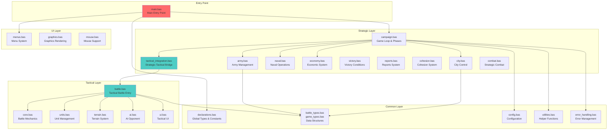
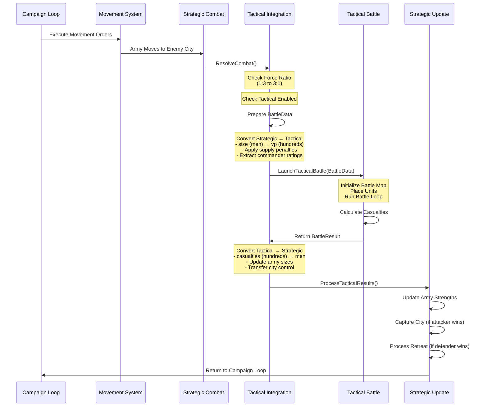
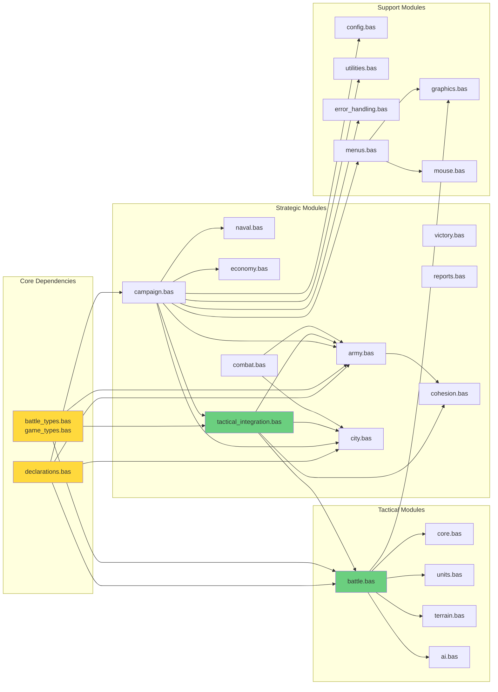
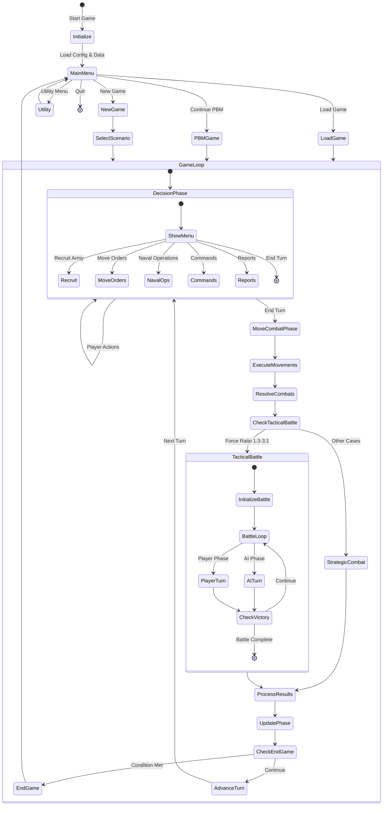
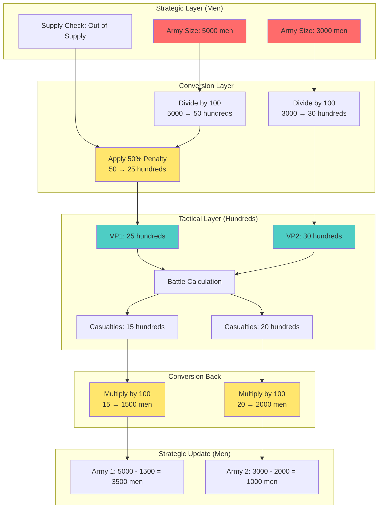

# Wars of Napoleon - Architecture Documentation

**Date:** 2024  
**Scope:** System architecture, module structure, and data flow diagrams  
**Language:** QB64/QBASIC

---

## 🏗️ Architecture Diagrams

### System Architecture Overview

The Wars of Napoleon game uses a unified architecture with three main layers: Common, Strategic, and Tactical. The game flow moves from strategic decision-making through tactical battles and back to strategic updates.

### Data Flow: Strategic to Tactical Integration

This diagram shows how data flows when a tactical battle is triggered from strategic combat.

### Module Dependency Graph

This diagram shows the dependency relationships between modules, indicating which modules depend on others.

### Game Loop Flow

This diagram shows the main game loop and how phases transition.

### Unit Conversion Flow

This diagram illustrates the critical unit conversions between strategic (men) and tactical (hundreds) layers.

### Key Architecture Notes

1. **Unified Architecture**: Unlike the original dual-executable design, the modern version uses direct function calls between strategic and tactical layers, eliminating file I/O overhead.

2. **Data Transformation**: The `tactical_integration.bas` module serves as the critical bridge, converting:
   - Strategic army sizes (men) ↔ Tactical VP (hundreds)
   - Strategic supply status → Tactical effectiveness penalties
   - Tactical battle results → Strategic army updates

3. **Module Organization**:
   - **Common**: Shared types, constants, and utilities
   - **Strategic**: Campaign management, army/city control, economy
   - **Tactical**: Battle mechanics, unit management, terrain
   - **UI**: Menus, graphics, mouse support

4. **Game Phases**:
   - **Decision Phase**: Player makes strategic decisions
   - **Move & Combat Phase**: Executes orders, resolves battles
   - **Update Phase**: Income, supply, turn advancement

5. **Battle Trigger Logic**:
   - Tactical battles trigger when force ratio is between 1:3 and 3:1
   - Requires tactical battles to be enabled in configuration
   - Falls back to strategic combat resolution otherwise

---

## Related Documentation

- **Code Analysis**: See `CODE_ANALYSIS.md` for code quality metrics and recommendations
- **Full Recreation Plan**: See `docs/FULL_RECREATION_PLAN.md` for implementation details
- **Strategic-Tactical Integration**: See `docs/STRATEGIC_TACTICAL_INTEGRATION.md` for detailed integration documentation

