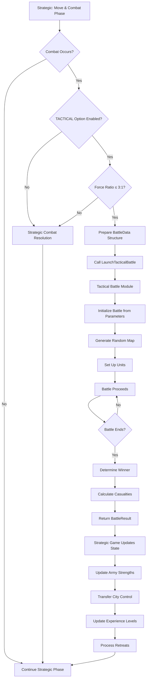
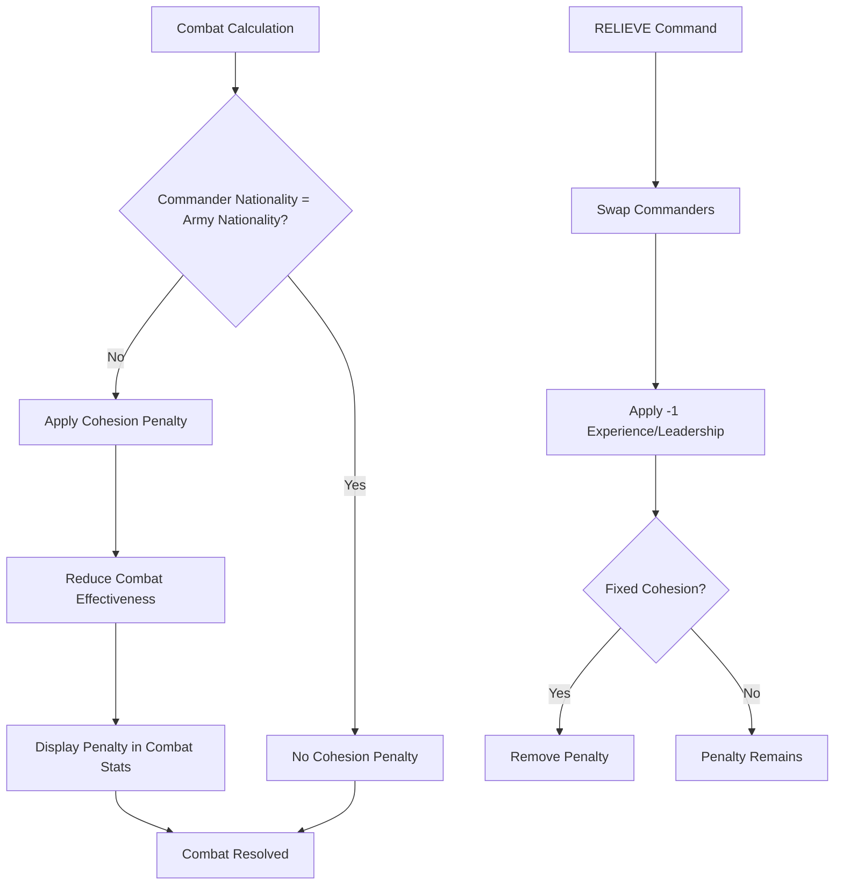

# Wars of Napoleon Full Recreation Plan

## Overview

This plan recreates the complete Wars of Napoleon game in QB64, modernizing the architecture from a dual-executable DOS design to a unified game with direct function calls between strategic and tactical modules. The implementation leverages ~70% reusable code from CWS/WW2 while building unique WON features from scratch.

## Architecture Modernization

### Current DOS Architecture

- **Strategic Module**: `WON.EXE` (separate executable)
- **Tactical Module**: `NAPOLEON.EXE` (separate executable)
- **Integration**: File-based (`battle.$$$` → `outcome.&&&`) + process spawning (`SHELL`)

### Modern Unified Architecture

- **Single Executable**: Unified game with both modules
- **Integration**: Direct function calls with parameters/return values
- **Benefits**: No file I/O overhead, no process spawning, simpler error handling, shared memory

## Implementation Phases

### Phase 1: Core Strategic Module Foundation

#### 1.1 Campaign Management System (`src/strategic/campaign.bas`)

- Port from CWS (2-month turn structure)
- Turn sequence: Decision → Move/Combat → Update
- Month/year tracking (March 1796, May 1796, etc.)
- Save/load system: 8 slots (`NWS1.SAV` - `NWS8.SAV`) + autosave (`NWS9.SAV`)
- Configuration management (`NWS.CFG`)

#### 1.2 Army Management System (`src/strategic/army.bas`)

- Port from CWS (generic armies, combine any)
- Army attributes: STRENGTH, LEADER, EXPERIENCE, SUPPLY
- Recruitment: 100 money, city-based
- Movement: Point-to-point between connected cities
- Commanders: 25 preset per side + generic fallbacks
- RELIEVE command: Port from CWS (commander swapping, -1 exp/lead)

#### 1.3 City/Territory Control (`src/strategic/city.bas`)

- City types: French (blue), Allied (red), Neutral (gray), At Peace (green), Objective (yellow cross)
- Fortification levels: None, FORT+, FORT++
- Income system: City value = income
- Victory points: City value + bonuses (objective cities +100 VP)

#### 1.4 Naval Operations (`src/strategic/naval.bas`)

- Port from WW2 (generic ships, 0-10 ships per fleet)
- Ship costs: 100 money
- Naval combat: 10 hits per ship, English 10% advantage
- Naval actions: Bombard, Blockade, Raid, Invasion

#### 1.5 Economic System (`src/strategic/economy.bas`)

- Port from CWS (harvest months: July, September free)
- Income: Generated from controlled cities
- Supply: Auto 0.002, Manual 0.001 per 1,000 men
- Unit costs: Recruitment 100, Fortification 200 per level

#### 1.6 Victory Conditions (`src/strategic/victory.bas`)

- Port from CWS (5 end game conditions)
- Conditions: Time, % Cities, % Income, Objective Capture, Army Strength Ratio
- End game bonus: +100 VP for triggering side
- High score tracking (`HISCORE.NWS`)

#### 1.7 Reports System (`src/strategic/reports.bas`)

- Port from CWS (7 reports including History/Recap)
- Reports: Friendly Army, Enemy Army, City, Force Summary, Intelligence, Battle Summary, Recap/History
- History files: `NWS.HIS`, `BATTSUMM`

#### 1.8 Scenario System (`src/strategic/scenario.bas`)

- Support 7 scenarios: 1796, 1805, 1807, 1808, 1812, 1813, 1815
- File structure: `NWSxxxx.INI`, `LEADxxxx.DAT`, `EUROxxxx.MAP`
- Scenario selection menu

### Phase 2: Unique WON Features

#### 2.1 Cohesion System (`src/strategic/cohesion.bas`)

**Nationality Assignment**:
- Cities: Read from `EUROxxxx.MAP` (country field)
- Armies: Set when recruited (based on city nationality)
- Commanders: Read from `LEADxxxx.DAT` (nationality field)

**Cohesion Check**: Combat penalty if commander nationality ≠ army nationality

**Combat Penalty Application**: Display in combat statistics, contrasting color

**Allied Country System**: Track at-war status, green circles for at-peace, auto-activate on invasion

**At Peace Status**: No income/recruitment for at-peace countries

#### 2.2 Tactical Integration System (`src/strategic/tactical_integration.bas`)

**Battle Trigger Logic**:
- Check TACTICAL option enabled (from `NWS.CFG`)
- Check force ratio ≤ 3:1
- If conditions met, call tactical battle function

**Battle Data Structure** (`src/common/battle_types.bas`):
```basic
TYPE BattleData
    scenario AS STRING
    side AS INTEGER
    sidex(1 TO 2) AS INTEGER
    commander(1 TO 2) AS STRING
    vp(1 TO 2) AS LONG
    leadbase(1 TO 2) AS INTEGER
    expbase(1 TO 2) AS INTEGER
    difficult AS INTEGER
    fort AS INTEGER
    quiet AS INTEGER
END TYPE

TYPE BattleResult
    winner AS INTEGER          ' 1 or 2 (side that won)
    casualties(1 TO 2) AS LONG  ' Casualties for each side
END TYPE
```

**Direct Function Call**: `result = LaunchTacticalBattle(battleData)`

**Result Processing**: Update strengths, city control, experience (+1 for winner), retreats

#### 2.3 Multiple Scenario Support

- Implement all 7 scenarios with proper data files
- Scenario-specific starting conditions
- Year-specific commander assignments

### Phase 3: Tactical Module Refactoring

#### 3.1 Refactor NAPOLEON.BAS (`src/tactical/battle.bas`)

- **Convert to Function**: Refactor main program into `LaunchTacticalBattle(battleData AS BattleData) AS BattleResult`
- **Remove File I/O**: Replace `battle.$$$` read with parameter input
- **Remove Process Spawning**: No `SHELL` command needed
- **Return Values**: Replace `outcome.&&&` write with return value
- **Error Handling**: Try/catch around tactical battle, fallback to strategic resolution

#### 3.2 Tactical Battle Core (`src/tactical/core.bas`)

- Battle map: 27×20 hex grid, random terrain generation
- Unit types: Infantry, Hollow Squares, Cavalry, Artillery, Generals
- Combat mechanics: Melee (4 intensity levels), Artillery bombardment, Cavalry charges
- Visibility & movement: Terrain-based visibility, hex movement
- Victory conditions: Objective control, Esprit de Corps

#### 3.3 Tactical UI (`src/tactical/ui.bas`)

- Map display with hex grid
- Unit rendering and selection
- Order interface (move, charge, rest, wait)
- Combat animations and feedback
- Victory/defeat screens

### Phase 4: Modernization Enhancements

#### 4.1 Mouse Support (`src/ui/mouse.bas`)

- Port from WW2
- Click menu selection
- Click map-based unit selection
- Click movement (origin → destination)
- Right mouse button = Escape
- Save preference to `NWS.CFG`

#### 4.2 PBM Support (`src/strategic/pbm.bas`)

- Port from WW2
- Create `PBM` file after each turn
- "Continue PBM Game" menu option
- Automated turn sequence
- Score screen at game end

#### 4.3 Move Capital (`src/strategic/move_capital.bas`)

- Port from CWS
- Add to Commands menu
- Cost: 500 money units
- Awards enemy 50 victory points
- Prevents objective capture ending game

#### 4.4 Realism Toggle (`src/strategic/realism.bas`)

- Port from CWS (adapted)
- Toggle in Utility menu
- When ON: City size affects recruitment, recruitment only in originally friendly/neutral, isolated cities reduced recruitment, increased defender advantage
- Save preference to `NWS.CFG`

#### 4.5 Additional Enhancements (Lower Priority)

- January Campaigns Toggle (CWS): Winter restrictions
- Check Links Utility (CWS): Map connectivity validation
- Graphics Levels (CWS): G0-G3 performance options
- End Game Bonuses (WW2): Enhance end game system
- Neutrals Option (WW2): VP cost for neutral cities
- Scenario Editor (WW2): User content creation

### Phase 5: Integration & Testing

#### 5.1 Unified Game Structure (`src/main.bas`)

- Main menu: New Game, Load Game, Continue PBM, Utility, Quit
- Game loop integration: Strategic → Tactical → Strategic
- Error handling and recovery
- Configuration management

#### 5.2 Data File Management

- Scenario data files: `NWSxxxx.INI`, `LEADxxxx.DAT`, `EUROxxxx.MAP`
- Save game format: `NWSx.SAV`
- Configuration: `NWS.CFG`
- History files: `NWS.HIS`, `BATTSUMM`

#### 5.3 Testing

- Unit tests for core systems
- Integration tests for strategic-tactical flow
- Scenario validation (all 7 scenarios)
- Save/load verification
- Performance testing

## File Structure

```
wars-of-napoleon/
├── src/
│   ├── main.bas                 # Main entry point, menu system
│   ├── common/
│   │   ├── battle_types.bas     # BattleData, BattleResult types
│   │   ├── game_types.bas       # Army, City, Commander types
│   │   └── config.bas           # Configuration management
│   ├── strategic/
│   │   ├── campaign.bas         # Turn structure, save/load
│   │   ├── army.bas             # Army management
│   │   ├── city.bas             # City/territory control
│   │   ├── naval.bas            # Naval operations
│   │   ├── economy.bas          # Economic system
│   │   ├── victory.bas          # Victory conditions
│   │   ├── reports.bas          # Reports system
│   │   ├── scenario.bas         # Scenario management
│   │   ├── cohesion.bas         # Cohesion system (WON unique)
│   │   ├── tactical_integration.bas  # Battle trigger & result processing
│   │   ├── move_capital.bas     # Move Capital (CWS)
│   │   ├── realism.bas          # Realism Toggle (CWS)
│   │   └── pbm.bas              # PBM Support (WW2)
│   ├── tactical/
│   │   ├── battle.bas           # Main tactical battle function
│   │   ├── core.bas             # Battle mechanics
│   │   ├── ui.bas               # Tactical UI
│   │   └── units.bas            # Unit types and behaviors
│   └── ui/
│       ├── mouse.bas            # Mouse support (WW2)
│       ├── graphics.bas         # Graphics rendering
│       └── menus.bas            # Menu system
├── data/
│   ├── scenarios/               # Scenario data files
│   │   ├── NWS1796.INI
│   │   ├── LEAD1796.DAT
│   │   ├── EURO1796.MAP
│   │   └── ... (other scenarios)
│   └── graphics/                # Graphics files (.EGA, .VGA)
├── docs/                        # Existing documentation
└── README.md
```

## Key Implementation Details

### Tactical Integration Flow



### Cohesion System Flow



## Code Reuse Strategy

### From CWS (~50% of strategic module)

- Campaign management (2-month turns)
- Army management (generic armies, combine any)
- Economic system (harvest months)
- Victory conditions (5 conditions)
- Reports (7 reports including History)
- RELIEVE command
- Move Capital
- Realism Toggle

### From WW2 (~20% of strategic module)

- Naval operations (generic ships)
- Mouse support
- PBM support
- Scenario Editor (optional)

### Must Build (~30% of strategic module)

- Tactical integration (simplified unified approach)
- Cohesion system
- Nationality tracking
- Allied country system
- Battle result processing

### Refactor (~100% of tactical module)

- Convert NAPOLEON.BAS to callable function
- Remove file I/O
- Remove process spawning
- Use direct parameters/return values

## Implementation Tasks

### Phase 1: Core Strategic Module Foundation

1. **Campaign Management** - Port from CWS (turn structure, save/load, configuration)
2. **Army Management** - Port from CWS (attributes, recruitment, movement, commanders, RELIEVE)
3. **City/Territory Control** - Port from CWS/WW2 (types, fortification, income, victory points)
4. **Naval Operations** - Port from WW2 (fleet management, combat, actions)
5. **Economic System** - Port from CWS (income, supply, costs, harvest months)
6. **Victory Conditions** - Port from CWS (5 conditions, end game bonus)
7. **Reports System** - Port from CWS (7 reports including History/Recap)
8. **Scenario System** - Implement 7 scenarios with file loading and selection menu

### Phase 2: Unique WON Features

9. **Cohesion System** - Build from scratch (nationality assignment, cohesion check, combat penalty, allied countries)
10. **Tactical Integration** - Build tactical integration system (battle trigger logic, BattleData/BattleResult types, direct function call interface)
11. **Multiple Scenarios** - Implement all 7 scenarios with proper data files and starting conditions

### Phase 3: Tactical Module Refactoring

12. **Refactor Tactical Module** - Refactor NAPOLEON.BAS into LaunchTacticalBattle function (remove file I/O, remove process spawning, use parameters/return values)
13. **Tactical Battle Core** - Implement tactical battle core (map generation, unit types, combat mechanics, visibility, victory conditions)
14. **Tactical UI** - Implement tactical UI (map display, unit rendering, order interface, combat animations)

### Phase 4: Modernization Enhancements

15. **Mouse Support** - Add mouse support - port from WW2
16. **PBM Support** - Add PBM support - port from WW2
17. **Move Capital** - Add Move Capital feature - port from CWS
18. **Realism Toggle** - Add Realism Toggle - port from CWS (adapted)

### Phase 5: Integration & Testing

19. **Unified Game Structure** - Integrate all modules into unified game structure (main menu, game loop, error handling)
20. **Testing** - Testing (unit tests, integration tests, scenario validation, save/load verification, performance testing)

## Success Criteria

1. ✅ All 7 scenarios playable
2. ✅ Tactical battles integrate seamlessly with strategic game
3. ✅ Cohesion system affects combat appropriately
4. ✅ Save/load works correctly
5. ✅ All reports generate correctly
6. ✅ Mouse support functional
7. ✅ PBM support functional
8. ✅ Performance acceptable (no lag in tactical battles)
9. ✅ Error handling robust (fallback to strategic resolution on tactical errors)

## Estimated Effort Breakdown

- **Phase 1 (Core Strategic)**: 40% - Mostly porting from CWS/WW2
- **Phase 2 (Unique WON Features)**: 25% - Building cohesion and tactical integration
- **Phase 3 (Tactical Refactoring)**: 20% - Refactoring NAPOLEON.BAS
- **Phase 4 (Enhancements)**: 10% - Adding modern features
- **Phase 5 (Integration & Testing)**: 5% - Integration and validation

**Total**: ~70% reusable code, ~30% new code

## References

- **Strategic Module Recreation Analysis**: `docs/STRATEGIC_MODULE_RECREATION_ANALYSIS.md`
- **Strategic-Tactical Integration**: `docs/STRATEGIC_TACTICAL_INTEGRATION.md`
- **Final Feature Analysis**: `docs/FINAL_FEATURE_ANALYSIS.md`
- **CWS Strategic Comparison**: `docs/CWS_STRATEGIC_COMPARISON.md`
- **WW2 Strategic Comparison**: `docs/WW2_STRATEGIC_COMPARISON.md`
- **WON Documentation**: `WON.DOC`
- **Tactical Module Source**: `NAPOLEON.BAS`

---

*Plan created based on comprehensive analysis of WON, CWS, and WW2 documentation and source code.*

