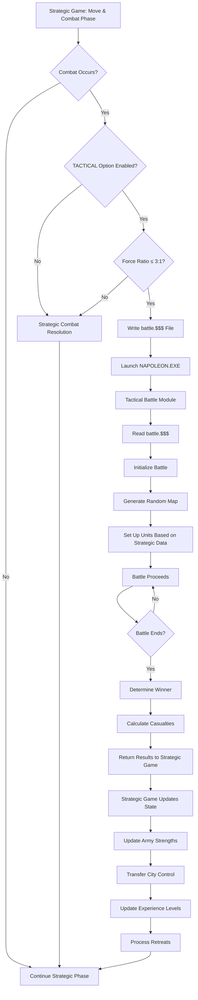

# Strategic-Tactical Integration Specification

## Executive Summary

The Wars of Napoleon (WON) game implements a two-level wargame architecture consisting of:

1. **Strategic Level** (`WON.EXE`) - Campaign management, army movement, city control, economic systems, and high-level battle resolution
2. **Tactical Level** (`NAPOLEON.EXE`) - Detailed hex-based battle resolution for individual engagements

This document specifies how these two components integrate, including data transfer mechanisms, trigger conditions, and implementation details.

The integration allows players to fight detailed tactical battles when strategic-level combat occurs under certain conditions, providing a seamless transition between strategic campaign management and tactical battlefield command.

---

## 1. Strategic Level Component Functionality

### 1.1 Campaign Management

**Turn Structure:**
- Each turn represents **2 months** of campaign time
- Game proceeds through months and years (e.g., March 1796, May 1796, etc.)
- Multiple scenarios available based on starting year (1796, 1805, 1807, 1808, 1812, 1813, 1815)

**Sequence of Play:**
1. **Decision Phase** - Both sides make decisions:
   - Recruit armies
   - Naval actions (resolved immediately)
   - Move orders
   - Other decisions (combine, fortify, supply, etc.)
2. **Move & Combat Update Phase** - Move orders executed, battles resolved
3. **Turn Update Phase** - Income updated, supply distributed

**Game State Persistence:**
- Save games: `NWSx.SAV` (x = 1-8)
- Autosave: `NWS9.SAV` (automatically updated at end of decision phase)
- Configuration: `NWS.CFG` (automatically updated when game saved)

### 1.2 Army Management

**Army Attributes:**
- **STRENGTH** - Number of men in unit (prime attribute in combat)
- **LEADER** - Ability score 1-10 (affects effectiveness in battle and movement)
- **EXPERIENCE** - Number of battles won (0-10), increases by 1 per victory
- **SUPPLY** - Current state of food/equipment (0-10)
  - Units use 1 supply per turn (except harvest months)
  - Out of supply (0) = 50% combat effectiveness, slower movement, cannot move in winter
  - Port cities provide supply unless blockaded

**Recruitment:**
- Cost: 100 money units per recruitment
- New armies created in owned or captured neutral cities
- Army size depends on city size/income
- Newly created armies cannot move the turn they're created
- Existing armies can move after receiving reinforcements

**Movement:**
- Point-to-point movement between connected cities
- Multiple friendly armies can stack in same city
- Movement into enemy-occupied city triggers combat
- Movement into unoccupied enemy city = automatic capture

**Commanders:**
- Each side has 25 preset commanders
- Generic commanders (Roman numerals) available if preset list exhausted
- Commanders removed from play when armies captured (except Napoleon)

### 1.3 City/Territory Control

**City Types:**
- **French controlled** - Blue circles
- **Allied controlled** - Red circles  
- **Neutral** - Gray circles
- **Allied at peace** - Green circles (not yet at war)
- **Objective cities** - Marked with yellow cross

**Fortification Levels:**
- **Unfortified** - Normal resistance
- **FORTIFIED+** - Hollow black box (50% combat bonus)
- **FORT++** - Solid black box (100% combat bonus)
- Fortification reduced by 1 level when city captured in combat
- Option to raze fortifications when capturing unoccupied fortified city

**Income & Victory Points:**
- Each city provides income and victory points based on its value
- Objective cities: +100 bonus victory points
- Losing objective = permanent loss of bonus income

### 1.4 Naval Operations

**Fleet Management:**
- Each side has one fleet (0-10 ships)
- Ships cost 100 money units
- Ships built only in port cities
- Ships can move to any port city per turn

**Naval Combat:**
- Fleets engage when meeting in same port
- Each ship can take 10 hits before sinking
- Attacker can press attack or retire each round
- English ships have 10% combat advantage

**Naval Actions:**
- **Bombardment** - Damage defending armies, reduce fortifications, drive cities to neutrality
- **Blockade** - Reduces enemy supply in blockaded ports
- **Commerce Raiding** - Reduces enemy income, risks ship loss
- **Marine Invasions** - Small-scale invasions at neutral cities (requires 2+ ships)

### 1.5 Economic System

**Income:**
- Generated from controlled cities
- Income amount = victory point value of city
- Allies receive bonus income from off-map territories
- Updated each turn based on city control

**Supply Management:**
- Automatic resupply: 0.002 money units per 1,000 men
- Manual resupply: 0.001 money units per 1,000 men (cheaper)
- Free resupply in July and September (harvest months)
- Blockaded ports cannot resupply
- Units supplied in numerical order (higher numbers last)

**Unit Costs:**
- Recruitment: 100 money units
- Fortification: 200 money units per level
- Supply: Variable based on unit size

### 1.6 Victory Conditions

**Victory Points Awarded For:**
1. Capturing cities (value varies by city)
2. Capturing armies (+25 bonus)
3. Winning battles (+1 per battle)
4. Special events (variable)

**End Game Conditions:**
- Time (Month & Year)
- % Cities Controlled
- % Income
- Objective Capture
- Total Army Strength Ratio
- Total elimination of enemy armies

**Game End:**
- Side triggering end condition receives +100 bonus victory points
- Top 5 scores recorded in `HISCORE.NWS`

---

## 2. Tactical Level Component Functionality

### 2.1 Battle Resolution

**Battle Map:**
- Hexagonal grid: 27 hexes wide × 20 hexes high
- Randomly generated terrain for each battle
- Terrain types: forest, road, bridge, clear, swamp, hill, river, mountain, fortification, village

**Unit Types:**
- **Infantry** - Average movement, average melee combat, can charge on open ground
- **Hollow Squares** - Defensive formation, good vs cavalry, poor vs infantry, cannot move
- **Cavalry** - Fast movement, good melee, excellent vs infantry on open terrain
- **Artillery** - Slow movement, poor melee, can fire at distance
- **Generals** - Average movement, poor melee, boosts adjacent units, can inspire/cancel orders

### 2.2 Combat Mechanics

**Melee Combat:**
- Four intensity levels: Light Skirmish (1), Medium Fight (2), Heavy Attack (3), All-Out Assault (8)
- Attacker goes first, then defender
- Factors: intensity, strength, leadership, morale, experience, terrain, unit type, adjacent generals, luck

**Artillery:**
- Can bombard visible enemies at distance
- Line of sight restrictions (trees, villages, hills block)
- Range depends on elevation and cover
- Canister fire at close range = devastating damage
- Risk of explosion killing battery members

**Cavalry Charges:**
- Automatic bonus on clear/road terrain
- Cavalry vs cavalry = test of nerves, both may rout
- Bridge hexes prevent charges

### 2.3 Visibility & Movement

**Visibility:**
- Friendly units always visible
- Enemy units visible when near friendly units
- Visibility affected by terrain:
  - Mountains/hills = increased visibility
  - Forests/swamps = decreased visibility
  - Enemy in forest = harder to see

**Movement:**
- Single hex movement using arrow keys
- Move-to-location orders (unit follows path automatically)
- Diagonal movement supported
- Terrain affects movement speed
- Units can rest (spacebar) or wait (W key)

**Special Movement:**
- Infantry charge (C key) - Double speed on open/road terrain
- Artillery must limber (L key) before moving
- Units under orders move automatically

### 2.4 Victory Conditions

**Tactical Victory:**
1. **Objective Control** - Hold objective on last turn of battle
2. **Esprit de Corps** - Cause enemy esprit de corps to fall so low entire army routs

**Esprit de Corps:**
- Overall army morale/spirit
- Rises when: taking objective, eliminating enemy unit, pursuing retreating unit
- Falls when: unit routed/eliminated (especially generals)
- Too low = entire army breaks and flees

**Strategic Retreat:**
- F9 key allows strategic retreat
- Loses objective, takes 20% additional losses
- Useful to avoid greater battlefield losses

---

## 3. Integration Interface

### 3.1 Trigger Conditions

**When Tactical Battles Are Launched:**

Tactical battles occur when **ALL** of the following conditions are met:

1. **TACTICAL option enabled** in Utility Menu (Registered Edition only)
2. **Force ratio ≤ 3:1** (attacker:defender ratio between 1:3 and 3:1)
   - More lopsided battles (>3:1) resolved at strategic level only
3. **Combat occurs** during Move & Combat Update Phase
4. **Strategic game writes** `battle.$$$` file with battle data

**Fortification Effects:**
- Fortified cities affect objective placement in tactical battle
- Unfortified: Objective near defender, not necessarily possessed
- Fortified/FORT++: Objective possessed by defender, terrain more difficult

**Supply Status Effects:**
- Out of supply armies have **50% tactical strength**
- Example: 100,000 man army out of supply = 50,000 strength points in tactical combat
- This may be reason for strategic retreat instead of tactical battle

### 3.2 Data Transfer (Strategic → Tactical)

**File Interface: `battle.$$$`**

The strategic game writes battle data to `battle.$$$` file, which the tactical module reads on startup.

**File Format** (from `NAPOLEON.BAS` line 27):
```basic
INPUT #1, SCENARIO$, side, sidex(1), sidex(2), commander$(sidex(1)), vp&(sidex(1)), 
          leadbase(sidex(1)), expbase(sidex(1)), commander$(sidex(2)), vp&(sidex(2)), 
          leadbase(sidex(2)), expbase(sidex(2)), difficult, fort, quiet
```

**Data Fields:**

| Field | Type | Description |
|-------|------|-------------|
| `SCENARIO$` | String | Scenario name/identifier |
| `side` | Integer | Current side (1=French, 2=Allies) |
| `sidex(1)` | Integer | Side 1 identifier |
| `sidex(2)` | Integer | Side 2 identifier |
| `commander$(sidex(1))` | String | Commander name for side 1 |
| `vp&(sidex(1))` | Long | Victory points/strength for side 1 (in 100s) |
| `leadbase(sidex(1))` | Integer | Base leadership rating for side 1 |
| `expbase(sidex(1))` | Integer | Base experience level for side 1 |
| `commander$(sidex(2))` | String | Commander name for side 2 |
| `vp&(sidex(2))` | Long | Victory points/strength for side 2 (in 100s) |
| `leadbase(sidex(2))` | Integer | Base leadership rating for side 2 |
| `expbase(sidex(2))` | Integer | Base experience level for side 2 |
| `difficult` | Integer | Difficulty level setting |
| `fort` | Integer | Fortification level (0=none, 1=FORT+, 2=FORT++) |
| `quiet` | Integer | Sound setting (0=sound, 1=quiet) |

**Data Processing in Tactical Module:**

From `NAPOLEON.BAS` lines 39-67:

1. **Unit Size Scaling:**
   ```basic
   unitsize& = vp&(1): IF vp&(2) > vp&(1) THEN unitsize& = vp&(2)
   unitsize& = 3 * unitsize&
   IF unitsize& < 500 THEN unitsize& = 500
   FOR k = 1 TO 2
       vp&(k) = vp&(k) * 100  'scale up unit size
   NEXT k
   ```
   - Base unit size = 3× larger of two armies
   - Minimum unit size = 500
   - Victory points scaled up by ×100

2. **Time Limit Calculation:**
   ```basic
   timelimit = 25 + 5 * fort
   IF vp&(1) > 200 AND vp&(2) > 200 THEN timelimit = 40 + 5 * fort
   IF side = sidex(2) THEN timelimit = timelimit + 10
   timelimit = timelimit + .1 * obstruct
   ```
   - Base: 25 turns + 5 per fortification level
   - Large armies (>200): 40 turns + 5 per fortification level
   - Defender gets +10 turns
   - Additional time for terrain obstruction

3. **Esprit de Corps Initialization:**
   ```basic
   FOR i = 1 TO 2
       k = sidex(i)
       a = leader(1): IF k = 1 THEN a = leader(41)
       elan(k) = 80 + 5 * (expbase(k) - 3) + 5 * (a - 3)
       CALL brittle(k)
   NEXT i
   ```
   - Base esprit de corps = 80
   - Modified by experience and leadership
   - Formula: 80 + 5×(experience-3) + 5×(leadership-3)

4. **Commander Assignment:**
   ```basic
   name$(1) = commander$(1)
   name$(41) = commander$(2)
   IF name$(41) = "Napoleon" THEN
       leader(41) = 5: xper(41) = 5: morale(41) = 5
   END IF
   ```
   - Commander names assigned to units
   - Special handling for Napoleon (boosted stats)

### 3.3 Data Transfer (Tactical → Strategic)

**Battle Results Returned:**

After tactical battle completes, results must be communicated back to strategic game. Based on documentation and code analysis:

1. **Battle Outcome:**
   - Winner determined (side controlling objective on last turn OR side that didn't rout)
   - Loser must retreat

2. **Casualties:**
   - Casualty counts for both sides
   - Expressed as numbers and percentages
   - Used to update army strengths in strategic game

3. **City Control:**
   - Winner takes possession of contested city
   - City control updated on strategic map
   - Color changes to reflect new ownership

4. **Retreat Requirements:**
   - Loser must retreat to adjacent friendly city
   - If no retreat path available, army surrenders
   - Commanders permanently removed if army surrenders

5. **Experience Gains:**
   - Winning units gain +1 experience level
   - Maximum experience = 10
   - Experience affects future combat effectiveness

6. **Supply Updates:**
   - Battle consumes supplies
   - Supply levels updated based on battle duration/intensity

**Return Mechanism:**

The tactical module likely writes results back to a file or uses return codes. The strategic game reads these results and updates game state accordingly.

### 3.4 Configuration

**TACTICAL Option (Utility Menu):**

From `WON.DOC` section 5.5:
- Toggle option in Utility Menu
- **Registered Edition ONLY**
- When checked ("✓"), tactical battles triggered for force ratios ≤ 3:1
- When unchecked, all battles resolved at strategic level
- Setting saved in `NWS.CFG` configuration file

**Configuration File Format:**

From `WON.DOC` section 7.3, `NWS.CFG` format:
```
1. Side chosen (1=French, 2=Allies)
2. Sounds (0=none, 1=sounds only, 2=sounds and music)
3. Play Balance (1=Allies++, 3=Balanced, 5=French++)
4. Computer Enemy aggressiveness (1=low, 5=high)
5. Number of players (1-2)
6. Display speed (1=very fast, 2=Normal, 4=very slow)
7. Random event balance (0=off, 3=favor Allies, 5=neutral, 7=favor French)
8. History switch (0=off, 1=on)
9. Tactical Battles (0=off, 1=on)  ← TACTICAL option
```

---

## 4. Integration Flow Diagram



---

## 5. Implementation Details

### 5.1 File Format Specifications

**`battle.$$$` File Format:**

The file is a simple text file with comma-separated values on a single line:

```
SCENARIO_NAME, side, sidex1, sidex2, commander1, vp1, lead1, exp1, commander2, vp2, lead2, exp2, difficult, fort, quiet
```

**Example:**
```
Waterloo, 1, 1, 2, Napoleon, 320, 9, 8, Wellington, 220, 8, 7, 3, 1, 0
```

**Field Descriptions:**

- **SCENARIO_NAME**: String identifier for the battle scenario
- **side**: Current side (1=French, 2=Allies)
- **sidex1, sidex2**: Side identifiers (typically 1 and 2)
- **commander1, commander2**: Commander names as strings
- **vp1, vp2**: Victory points/strength in hundreds (e.g., 320 = 32,000 men)
- **lead1, lead2**: Leadership ratings (1-10)
- **exp1, exp2**: Experience levels (0-10)
- **difficult**: Difficulty level (typically 1-5)
- **fort**: Fortification level (0=none, 1=FORT+, 2=FORT++)
- **quiet**: Sound setting (0=sound on, 1=quiet)

### 5.2 Command-Line Invocation

**Standalone Mode:**
- Tactical module can be run standalone: `NAPOLEON` at command prompt
- In standalone mode, reads `battle.$$$` if present, otherwise uses default scenario

**Integrated Mode:**
- Strategic game launches tactical module when conditions met
- Likely uses DOS `SHELL` command or equivalent: `SHELL "NAPOLEON.EXE"`
- Tactical module reads `battle.$$$` on startup
- After battle, tactical module exits and control returns to strategic game

### 5.3 Return Code Handling

**Expected Return Codes:**
- **0** - Normal completion, battle resolved
- **Non-zero** - Error condition (file not found, invalid data, etc.)

**Error Handling:**
- Strategic game should check return code
- If error, fall back to strategic combat resolution
- Log error for debugging

### 5.4 Error Handling

**Common Error Scenarios:**

1. **`battle.$$$` file not found**
   - Tactical module should display error and exit
   - Strategic game falls back to strategic resolution

2. **Invalid file format**
   - Tactical module should validate data on read
   - Display error message and exit gracefully

3. **Missing graphics files**
   - Tactical module requires `.EGA` files for display
   - Should check for required files on startup

4. **Out of memory**
   - Large battles may exceed available memory
   - Should handle gracefully with error message

**Best Practices:**
- Validate all input data
- Provide clear error messages
- Always return to strategic game (don't hang)
- Save game state before launching tactical battle

---

## 6. Key Integration Points Summary

### Strategic → Tactical Data Flow

1. **Army Strengths** - Scaled and converted to tactical unit sizes
2. **Commander Names** - Assigned to tactical units
3. **Leadership Ratings** - Used for unit effectiveness and esprit de corps
4. **Experience Levels** - Affects unit combat performance
5. **Supply Status** - If out of supply, tactical strength = 50% of nominal
6. **Fortification Level** - Affects objective placement and terrain difficulty
7. **Scenario Name** - For identification and historical context
8. **Difficulty Settings** - Affects AI behavior and combat calculations

### Tactical → Strategic Data Flow

1. **Battle Winner** - Determines city control and retreat requirements
2. **Casualties** - Updates army strengths in strategic game
3. **City Control** - Transfers ownership on strategic map
4. **Retreat Path** - Determines where losing army moves
5. **Experience Gains** - Winning units gain +1 experience
6. **Supply Consumption** - Battle reduces supply levels

### Critical Integration Rules

1. **Force Ratio Threshold**: Tactical battles only for ratios ≤ 3:1
2. **Supply Penalty**: Out of supply = 50% tactical strength
3. **Fortification Effect**: Affects objective placement and battle duration
4. **Time Limit**: Based on fortification level and army sizes
5. **Experience Transfer**: Winning units gain experience in strategic game
6. **Commander Continuity**: Commander names and abilities transfer to tactical battle

---

## 7. References

### Source Files

- **Strategic Game Documentation**: `c:\code\hutsell\wars-of-napoleon\WON.DOC`
- **Tactical Game Documentation**: `c:\code\hutsell\wars-of-napoleon\NAPOLEON.DOC`
- **Tactical Game Source**: `c:\code\hutsell\wars-of-napoleon\NAPOLEON.BAS`
- **Integration Reference**: `WON.DOC` sections 1.4 and 5.5

### Key Code References

- **File Read**: `NAPOLEON.BAS` line 26-28
- **Unit Scaling**: `NAPOLEON.BAS` lines 39-45
- **Time Limit**: `NAPOLEON.BAS` lines 31-38
- **Esprit de Corps**: `NAPOLEON.BAS` lines 62-67
- **Commander Assignment**: `NAPOLEON.BAS` lines 50-54

---

*Document created based on analysis of WON.DOC, NAPOLEON.DOC, and NAPOLEON.BAS source code.*

